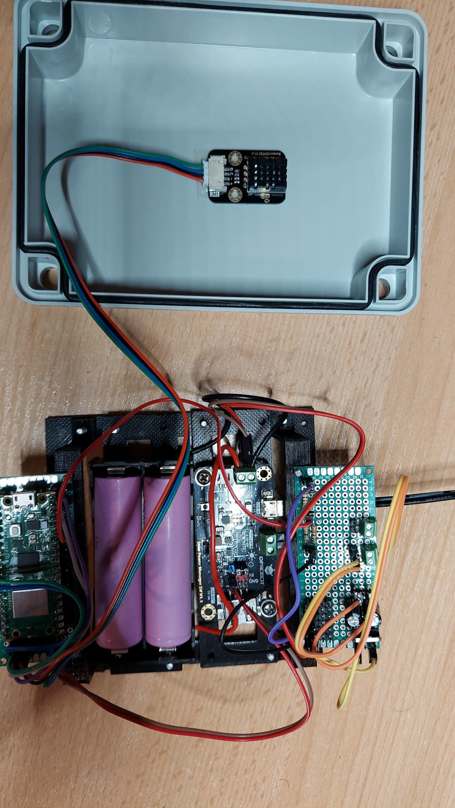
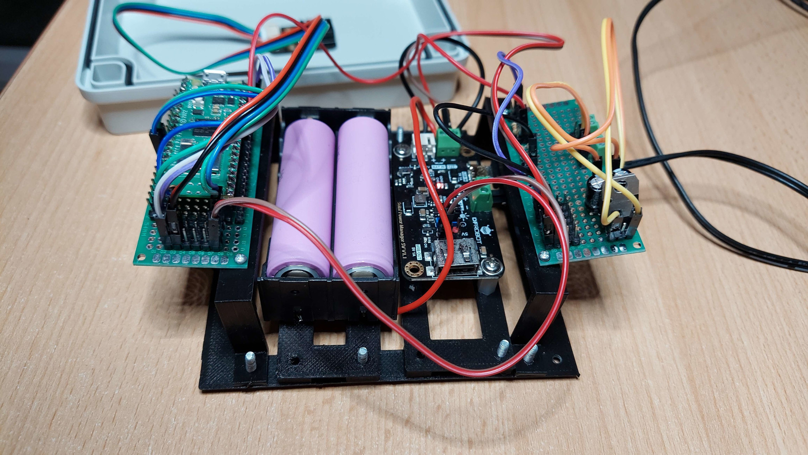
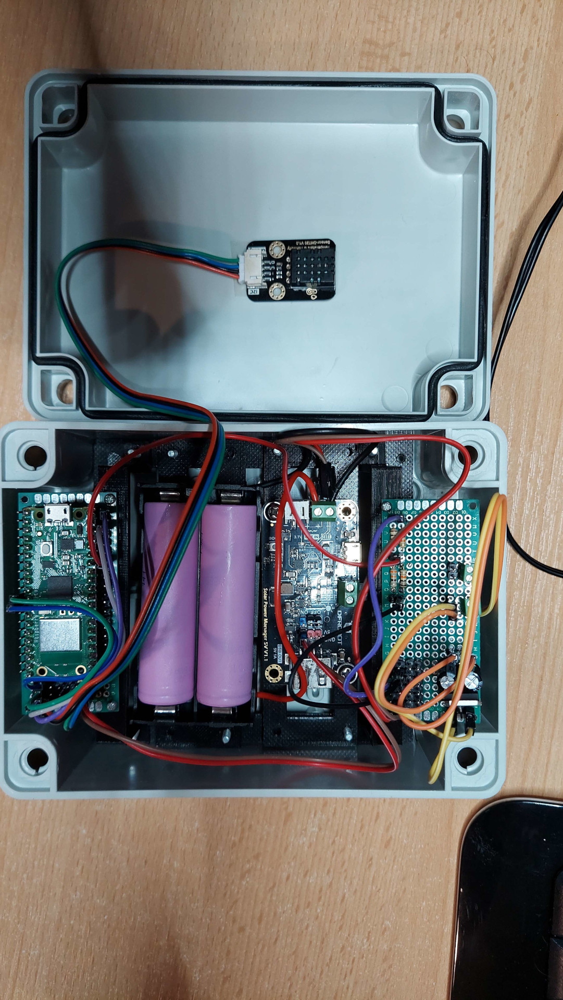

### PicoWeatherStation

Raspberry Pico W powered weather station integrated with [WeatherStationAPI](https://github.com/zNitche/WeatherStationAPI)

---

#### Setup
Setup config variables in (`config.py`):
- `APIConsts`
- `NetworkConfig`

#### Features
- Logging temperature.
- Logging humidity.
- Logging battery voltage.

#### Parts
- 1x Raspberry Pi Pico W
- 1x DHT20 temperature and humidity sensor
- 1x Circuit board
- 2x 470 uF capacitors
- 1x L7805ABV 5V voltage regulator
- Some gold pin connectors
- Some connecting wires
- 2x 18650 li-ion battery
- Solar Power Manager (CN3065)
- Waterproof case

#### Media

